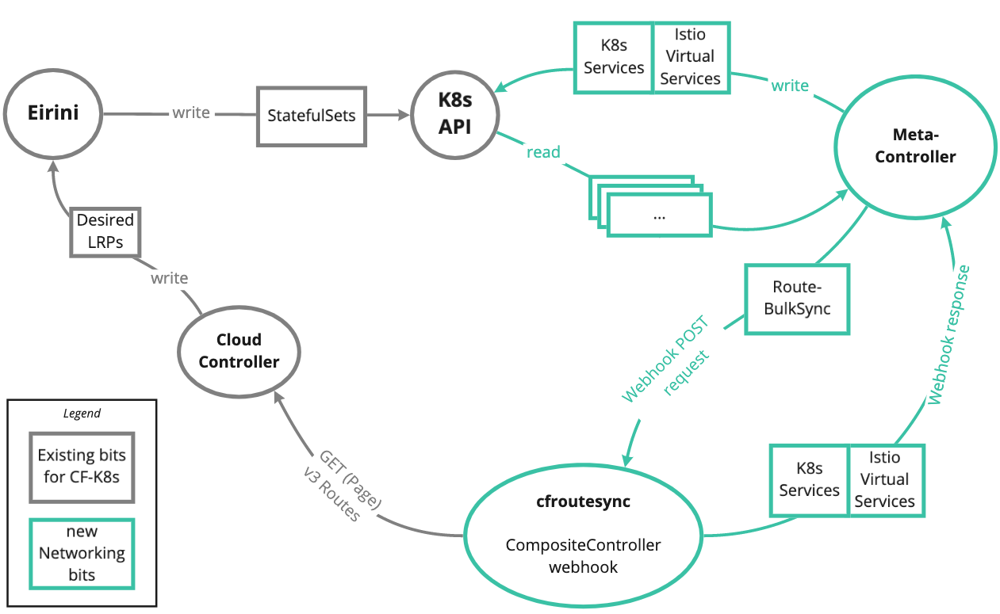

[](https://github.com/cloudfoundry/cf-k8s-networking/actions?query=workflow%3A%22Test+and+Tag%22)

cf-k8s-networking
---
​
Routing and networking for Cloud Foundry running on Kubernetes.

​

​
## Installation

### Prerequisites
- A Cloud Foundry deployment using [Eirini](https://github.com/cloudfoundry-incubator/eirini) for app workloads
- `kubectl` installed and access to the Kubernetes cluster backing Eirini
- `helm` installed

### Istio
* Install [Istio](https://istio.io/docs/setup/install/kubernetes/) on the Kubernetes cluster
    
    * We are testing with the "default" configuration using [these config overrides](ci/istio-config/overrides.yaml).
    * As an example, in our CI we are installing Istio using the [deploy-istio.sh](ci/tasks/istio/deploy-istio.sh) task.
    
 * Enable [automatic sidecar injection](https://istio.io/docs/setup/additional-setup/sidecar-injection/#automatic-sidecar-injection) for the workloads namespace
    
    ```bash
    kubectl label namespace cf-workloads istio-injection=enabled
    ```
​
### Metacontroller
* Install [Metacontroller](https://metacontroller.app/guide/install/) on the Kubernetes cluster
​
### CF-K8s-Networking
1.  `cfroutesync` needs to be able to authenticate with UAA and fetch routes from Cloud Controller. To do this you must override the following properties from `install/helm/networking/values.yaml`.
    You can do this by creating a new file `/tmp/secrets.yaml` that contains the following information:
    
    ```yaml
    cfroutesync:
      ccCA: 'path_to_cloud_controller_ca'
      ccBaseURL: 'https://api.example.com'
      uaaCA: 'path_to_uaa_ca'
      uaaBaseURL: 'https://uaa.example.com'
      clientName: 'uaaClientName'
      clientSecret: 'uaaClientSecret'
    ```
    
    The UAA client specified by `clientName` is used for fetching routing data from Cloud Controller. It must have permission to access all routes and domains in the deployment. We recommend using a client with at least the `cloud_controller.admin_read_only` authority.
    For example, see the [network-policy](https://github.com/cloudfoundry/cf-deployment/blob/5b0221eac8579aa3c3ecfb4b714d96adf55a34a0/cf-deployment.yml#L662-L665) client in cf-deployment.
    
    As an example, for our dev environments we are using the [generate_values.rb](install/scripts/generate_values.rb) script
    to populate these values from the `bbl-state.json` and secrets in CredHub.
    
1. Apply the required CRDs:
    
    ```bash
    kubectl apply -f cfroutesync/crds/routebulksync.yaml
    ```
1. Deploy the cf-k8s-networking components using `helm` and `kubectl`:
    
    ```bash
    helm template install/helm/networking/ --values /tmp/secrets.yaml | kubectl apply -f-
    ```
