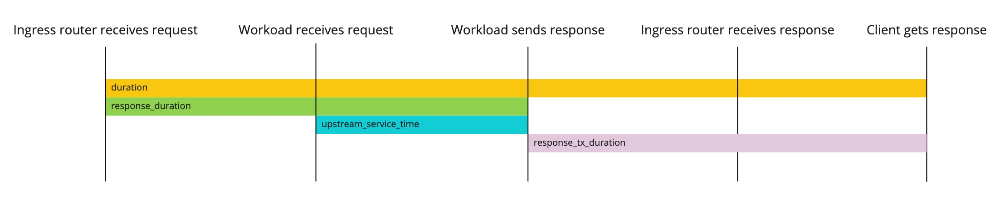

## Access Logs

### How to view access logs?

Ingress traffic to Cloud Foundry is proxied through the `istio-ingressgateway` pods which prints access logs to stdout. To view them:

```
kubectl logs -l app=istio-ingressgateway -c istio-proxy -n istio-system
```


### Fields

* `app_id`: Cloud Foundry application GUID
* `authority`: `Authority` (HTTP/2) or `Host` header (HTTP/1.1) of the request; see [RFC7540](https://tools.ietf.org/html/rfc7540#section-8.1.2.3) for more details
* `bytes_received`: Body bytes received, [%BYTES_RECEIVED% in Envoy](https://www.envoyproxy.io/docs/envoy/latest/configuration/observability/access_log.html?highlight=BYTES_RECEIVED)
* `bytes_sent`: Body bytes sent. For WebSocket connections it will also include response header bytes; [%BYTES_SENT% in Envoy](https://www.envoyproxy.io/docs/envoy/latest/configuration/observability/access_log.html?highlight=BYTES_SENT)
* `downstream_local_address`: Local address of the downstream connection; see [%DOWNSTREAM_LOCAL_ADDRESS% in Envoy docs](https://www.envoyproxy.io/docs/envoy/latest/configuration/observability/access_log.html?highlight=DOWNSTREAM_LOCAL_ADDRESS)
* `downstream_remote_address`: Remote address of the downstream connection; see [%DOWNSTREAM_REMOTE_ADDRESS% in Envoy docs](https://www.envoyproxy.io/docs/envoy/latest/configuration/observability/access_log.html?highlight=DOWNSTREAM_REMOTE_ADDRESS)
* `duration`: Total duration in milliseconds of the request from the start time to the last byte out; see [%DURATION% in Envoy docs](https://www.envoyproxy.io/docs/envoy/latest/configuration/observability/access_log.html?highlight=DURATION)
* `method`: Method of HTTP request
* `organization_id`:  Cloud Foundry organization GUID of the application
* `path`: HTTP request path
* `process_type`: [Cloud Foundry Process Type](https://v3-apidocs.cloudfoundry.org/version/3.80.0/index.html#processes) for the backend being routed to.
* `protocol`: See [%PROTOCOL% in Envoy docs](https://www.envoyproxy.io/docs/envoy/latest/configuration/observability/access_log.html?highlight=PROTOCOL)
* `referer`: HTTP `Referer` header "%REQ(REFERER)%"
* `request_id`: Unique ID for the request "%REQ(X-REQUEST-ID)%"
* `requested_server_name`: String value set on ssl connection socket for Server Name Indication (SNI); see [%REQUESTED_SERVER_NAME% in Envoy docs](https://www.envoyproxy.io/docs/envoy/latest/configuration/observability/access_log.html?highlight=REQUESTED_SERVER_NAME)
* `response_code`: HTTP response code. Note that a response code of ‘0’ means that the server never sent the beginning of a response. This generally means that the (downstream) client disconnected; see [%RESPONSE_CODE% in Envoy docs](https://www.envoyproxy.io/docs/envoy/latest/configuration/observability/access_log.html?highlight=RESPONSE_CODE)
* `response_duration`: Total duration in milliseconds of the request from the start time to the first byte read from the workload; see [%RESPONSE_DURATION% in Envoy docs](https://www.envoyproxy.io/docs/envoy/latest/configuration/observability/access_log.html?highlight=RESPONSE_DURATION)
* `response_flags`: Additional details about the response or connection, if any; see [%RESPONSE_FLAGS% in Envoy docs](https://www.envoyproxy.io/docs/envoy/latest/configuration/observability/access_log.html?highlight=RESPONSE_FLAGS) for flags description
* `response_tx_duration`: Total duration in milliseconds of the request from the first byte read from the workload to the last byte sent downstream; see [%RESPONSE_TX_DURATION% in Envoy docs](https://www.envoyproxy.io/docs/envoy/latest/configuration/observability/access_log.html?highlight=RESPONSE_TX_DURATION)
* `space_id`: Cloud Foundry space GUID of the application
* `start_time`: Request start time including milliseconds; see [%START_TIME% in Envoy docs](https://www.envoyproxy.io/docs/envoy/latest/configuration/observability/access_log.html?highlight=START_TIME)
* `upstream_cluster`: see [%UPSTREAM_CLUSTER% in Envoy docs](https://www.envoyproxy.io/docs/envoy/latest/configuration/observability/access_log.html?highlight=UPSTREAM_CLUSTER)
* `upstream_host`: see [%UPSTREAM_HOST% in Envoy docs](https://www.envoyproxy.io/docs/envoy/latest/configuration/observability/access_log.html?highlight=UPSTREAM_HOST)
* `upstream_local_address`: see [%UPSTREAM_LOCAL_ADDRESS% in Envoy docs](https://www.envoyproxy.io/docs/envoy/latest/configuration/observability/access_log.html?highlight=UPSTREAM_LOCAL_ADDRESS)
* `upstream_service_time`: Time in milliseconds spent by the workload processing the request; see [Duration Fields](#duration-fields) for more info and also see [Envoy docs](https://www.envoyproxy.io/docs/envoy/latest/configuration/http/http_filters/router_filter#x-envoy-upstream-service-time)
* `upstream_transport_failure_reason`: If upstream connection failed due to transport socket (e.g. TLS handshake), provides the failure reason from the transport socket; see [%UPSTREAM_TRANSPORT_FAILURE_REASON% in Envoy docs](https://www.envoyproxy.io/docs/envoy/latest/configuration/observability/access_log.html?highlight=UPSTREAM_TRANSPORT_FAILURE_REASON)
* `user_agent`: HTTP request `User-Agent` header
* `x_b3_parentspanid`: Used for request tracing, see [b3-propagation](https://github.com/openzipkin/b3-propagation) for more info
* `x_b3_spanid`: Used for request tracing, see [b3-propagation](https://github.com/openzipkin/b3-propagation) for more info
* `x_b3_traceid`: Used for request tracing, see [b3-propagation](https://github.com/openzipkin/b3-propagation) for more info
* `x_forwarded_for`: IP of the client used to initiate the request
* `x_forwarded_proto`: Protocol a client used to initiate the request. Can be `http` or `https` for HTTP traffic.

### Duration fields

The access log contains the following fields for duration:

- `upstream_service_time`: time in milliseconds spent by the workload processing the request. 
- `duration`: total duration in milliseconds of the request from the start time to the last byte out.
- `response_duration`: total duration in milliseconds of the request from the start time to the first byte read from the workload.
- `response_tx_duration`: total duration in milliseconds of the request from the first byte read from the workload to the last byte sent downstream.

If you want to determine workload time compared to network and router latency you can compare `upstream_service_time` which 
is time spent in the workload with `response_duration - upstream_service_time` which will contain router and network latency.
Latencies above 100ms can indicate problems with the network. An alert value on this metric should be tuned to the specifics of the deployment and its underlying network considerations; a suggested starting point is 100ms.



### Example access log line

```json
{
  "app_id": "58d9bc59-3993-4541-90fb-efe8f20acab9",
  "authority": "app.example.com",
  "bytes_received": "0",
  "bytes_sent": "846",
  "downstream_local_address": "10.56.1.110:80",
  "downstream_remote_address": "203.0.113.4:13456",
  "duration": "3",
  "method": "GET",
  "organization_id": "28a72883-be4e-4124-9f79-f8429a2d1256",
  "path": "/headers",
  "process_type": "-",
  "protocol": "HTTP/1.1",
  "referer": "-",
  "request_id": "eb36b92b-f757-4ca3-b27c-cef2e7e06944",
  "requested_server_name": "-",
  "response_code": "200",
  "response_duration": "3",
  "response_flags": "-",
  "response_tx_duration": "0",
  "space_id": "9765ce8d-5098-4756-a270-490c32233e4a",
  "start_time": "2020-02-07T00:47:45.516Z",
  "upstream_cluster": "outbound|8080||s-d77075c0-5c71-4d93-8c39-b8311c19be5d.cf-workloads.svc.cluster.local",
  "upstream_host": "10.56.1.111:8080",
  "upstream_local_address": "-",
  "upstream_service_time": "3",
  "upstream_transport_failure_reason": "-",
  "user_agent": "curl/7.54.0",
  "x_b3_parentspanid": "-",
  "x_b3_spanid": "dacd7b5fc2e62cb7",
  "x_b3_traceid": "a6a1631bae96ac75dacd7b5fc2e62cb7",
  "x_forwarded_for": "203.0.113.4",
  "x_forwarded_proto": "http"
}
```
