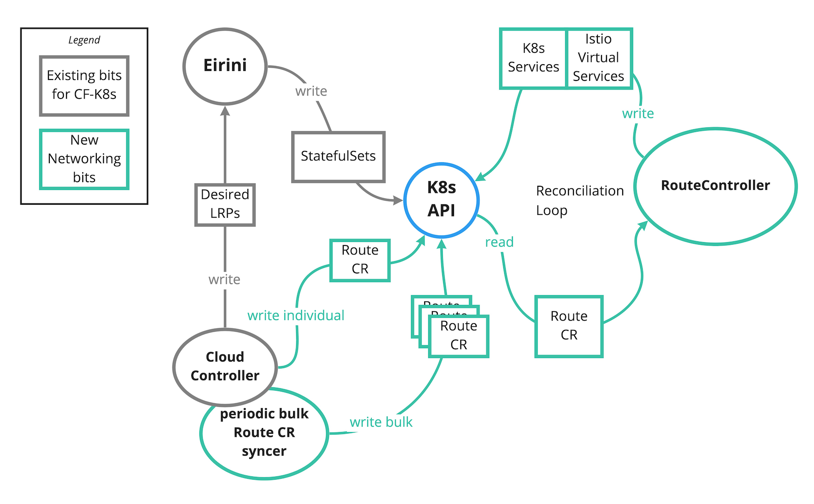

# 10. Create Route CRD and use Kubebuilder Instead of cfroutesync/Metacontroller

Date: 2020-05-05

## Status

Accepted

## Context

### Proposed Design
The proposal and discussion for the Route CRD and design can be found [here](https://docs.google.com/document/d/1DF7eTBut1I74w_sVaQ4eeF74iQes1nG3iUv7iJ7E35U/edit?usp=sharing).

### Summary
In order to achieve our scaling targets for the cf-for-k8s networking control plane, we need a "fast path" for networking changes to propagate from Cloud Controller to Kubernetes. The periodic sync loop implementation of `cfroutesync` and Metacontroller adds around 7 seconds of latency **on top** of the ~7 seconds of Istio control plane latency which in total exceed our scaling targets1.

We propose:
1. Replacing our sync loop with a `Route` [Kubernetes custom resource definition (CRD)](https://kubernetes.io/docs/concepts/extend-kubernetes/api-extension/custom-resources/) and a controller that manages networking resources based on these Routes.
2. Cloud Controller updates Route resources directly on the Kubernetes API as a result of user actions (e.g. `cf map-route`)
3. Keeping a periodic sync loop will between Cloud Controller's database (CCDB) and the Kubernetes API to ensure consistency.

## Decision

We will introduce a `Route` CRD and build a `RouteController` using the Kubebuilder v2 controller framework.

Cloud Controller will be updated to perform CRUD operations on Kubernetes`Route` resources in both its v2 and v3 APIs.

We will remove `cfroutesync` and dependencies on Metacontroller.

## Consequences
This reverses the [previous decision (ADR 2)](https://github.com/cloudfoundry/cf-k8s-networking/blob/develop/doc/architecture-decisions/0002-directly-create-istio-resources.md) to use Metacontroller and directly create Kubernetes and Istio resources.

#### Route CRD
* Decouples cf-k8s-networking from Cloud Controller. Additional routing control planes could be added in the future or developers could use `kubectl` directly.
* Abstracts the underlying ingress implementation away from Cloud Controller. We could replace Istio with an alternative ingress solution without requiring CC changes.
* Moves us closer to a more "Kubernetes native" design.
* Potential downside of adding yet another CRD is that it may put more load on the Kubernetes API / etcd. Could become an issue as other teams also move to CRD-based designs.

#### Using Kubebuilder
* Provides Community buy-in; the `kubebuilder` framework is the encouraged way to engineer a CRD
* Provides built-in best practices for writing a controller, including: shared caching, retries, back-offs, leader election for high availability deployments, etc...

#### Removal of Metacontroller
Removal of Metacontroller alleviates some future problems:
* As discussed in [ADR 2](https://github.com/cloudfoundry/cf-k8s-networking/blob/develop/doc/architecture-decisions/0002-directly-create-istio-resources.md), Metacontroller did not support the many Route to one VirtualService object relationship which required us to aggregate Routes from Cloud Controller ourselves. With Kubebuilder we can support this relationship and keep the data representations consistent across both the Cloud Controller and Kubernetes APIs.
* The Metacontroller design, most likely, does not provide necessary metrics for GA
* Metacontroller itself is [no longer supported](https://github.com/GoogleCloudPlatform/metacontroller/issues/184) and currently presents issues with Kubernetes `v1.16+`

### Footnotes
_1 Routing changes should take effect in under 10 seconds on an environment with 2000 app instances and 1000 routes._

