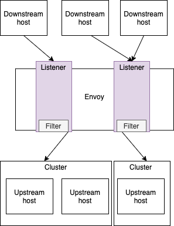
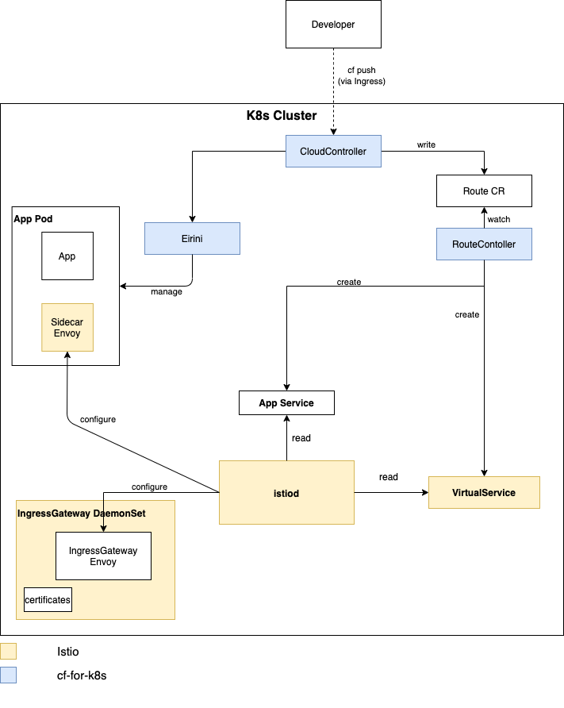
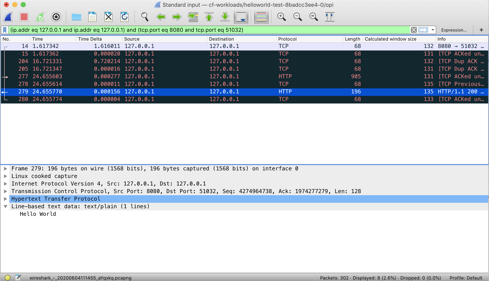

# CF for K8s networking

<!-- TOC depthfrom:2 depthto:5 withlinks:true updateonsave:false orderedlist:false -->

- [CF for K8s networking](#cf-for-k8s-networking)
  - [Purpose of this Document](#purpose-of-this-document)
  - [Network Traffic](#network-traffic)
  - [Envoy Terminology](#envoy-terminology)
  - [CloudFoundry, Istio and Envoy Config Diffs](#cloudfoundry-istio-and-envoy-config-diffs)
    - [Push Single App](#push-single-app)
      - [Changes on Istio and cf-for-k8s components](#changes-on-istio-and-cf-for-k8s-components)
      - [Changes in Ingress Envoy config](#changes-in-ingress-envoy-config)
    - [Push Another App](#push-another-app)
    - [Map Additional Route](#map-additional-route)
      - [Changes on Istio and cf-for-k8s components](#changes-on-istio-and-cf-for-k8s-components-1)
      - [Changes in Envoy config](#changes-in-envoy-config)
  - [Istio implementation details of Sidecar Envoy](#istio-implementation-details-of-sidecar-envoy)
    - [Sidecar Envoy](#sidecar-envoy)
    - [How traffic is forwarded from sidecar to app container](#how-traffic-is-forwarded-from-sidecar-to-app-container)
    - [How egress is forwarded from the app container](#how-egress-is-forwarded-from-the-app-container)
  - [Traffic restrictions](#traffic-restrictions)
    - [Egress](#egress)
  - [Debugging](#debugging)
    - [Log levels](#log-levels)
    - [Looking into the TCP layer](#looking-into-the-tcp-layer)
    - [When to use which method of traffic debugging](#when-to-use-which-method-of-traffic-debugging)

<!-- /TOC -->

## Purpose of this Document
This document is meant to be a guide for learning in-depth how the new cf-for-k8s network stack works. It was created by deploying cf-for-k8s and observing
what happens when apps are pushed and traffic flows through the cluster.

A special focus was put on these areas:
- Architecture (terminology, physical and logical layout)
- What happens in Istio and Envoy when CF apps change (push, map-route)
- How can network traffic be observed / tapped (and how this differs from the BOSH world)

This document shall be a living text that continuously evolves as cf-for-k8s develops further. Ideally, changes in upstream design or software should be backported to reflect the most current version of cf-for-k8s. The examples should be kept accurate and debugging tools should work with the respective latest release.


## Network Traffic
The following diagram shows an overview of the network traffic at runtime. Ingress traffic is forwarded by the LoadBalancer to the IngressGateway Envoy which has discovered endpoint information about apps and services. The IngressGateway Envoy also holds certificates needed for (m)TLS connections to the client. Based on the L7 information of the (HTTP) request, the matching endpoint is selected and the request is forwarded to the Sidecar Envoy of that endpoint. The sidecar eventually forwards the request to the app or service process on the local node.


| Entity                                                                                                                                                                                         | Description                                                                                                                                                                                                                                                                                                                                                                                                                                                                                                                                                                                                            |
| ------------------------------------------------------------------------------------------------------------------------------------------------------------------------------------------------ | ---------------------------------------------------------------------------------------------------------------------------------------------------------------------------------------------------------------------------------------------------------------------------------------------------------------------------------------------------------------------------------------------------------------------------------------------------------------------------------------------------------------------------------------------------------------------------------------------------------------------- |
| Client | A client which would like to talk to the application.|
| [LoadBalancer](https://kubernetes.io/docs/tasks/access-application-cluster/create-external-load-balancer/)                                                                              | Exposes the Service externally using a cloud provider’s load balancer.|
| IngressGateway Envoy| They act as a central ingress for clients outside the Istio service mesh. From now on it will be called in this document Ingress Envoy.|
| App | This is the application, which is deployed by the developer and used by the client. The inbound traffic is routed through the Envoy, which is running in a sidecar.
| Sidecar Envoy | Every instance(replica) of an app has a Sidecar Envoy (see more about the [Sidecar Pattern](https://www.magalix.com/blog/the-sidecar-pattern)), which runs in parallel with the app. These Envoys intercept any network traffic (ingress and egress) of the application and apply some filters depending on the Istio configuration (e.g. routing, retries, circuit-breaking).|

## Envoy Terminology

Istio’s traffic management model relies on the Envoy Proxies that are deployed along with apps. This section provides a short overview about the terminology used by Envoy.



| Entity                                                                                                                                                                                         | Description                                                                                                                                                                                                                                                                                                                                                                                                                                                                                                                                                                                                            |
| ------------------------------------------------------------------------------------------------------------------------------------------------------------------------------------------------ | ---------------------------------------------------------------------------------------------------------------------------------------------------------------------------------------------------------------------------------------------------------------------------------------------------------------------------------------------------------------------------------------------------------------------------------------------------------------------------------------------------------------------------------------------------------------------------------------------------------------------- |
| Downstream Host | A client connecting to Envoy in order to reach a backend app/service.|
| Listener |  Envoy module responsible for binding to an IP/port.|
| Filter | Pluggable logic that allows traffic manipulation and routing decisions to upstream clusters.|
| Route | Configuration to which cluster the traffic is forwarded.|
| Cluster | Endpoints that requests are forwarded to by Envoy using load balancing. Don't confuse Envoy cluster with Kubernetes cluster.|
| Upstream host | An endpoint.|

See also [Envoy terminology](https://www.envoyproxy.io/docs/envoy/latest/intro/life_of_a_request#terminology)

An example of simple [Envoy configuration](assets/network-simple-envoy.yaml)

## CloudFoundry, Istio and Envoy Config Diffs
This section describes what happens during common `cf push` and `map-route` use-cases.
For this purpose, a single app `test-app-a` is pushed, then another app `test-app-b`.
Finally, an additional route is mapped to the existing app and the effects on CF, Istio and Envoy layers are documented.

The picture illustrates what is happen during `cf push`.



| Entity                                                                                                                                                                                         | Description                                                                                                                                                                                                                                                                                                                                                                                                                                                                                                                                                                                                            |
| ------------------------------------------------------------------------------------------------------------------------------------------------------------------------------------------------ | ---------------------------------------------------------------------------------------------------------------------------------------------------------------------------------------------------------------------------------------------------------------------------------------------------------------------------------------------------------------------------------------------------------------------------------------------------------------------------------------------------------------------------------------------------------------------------------------------------------------------- |
| Developer | The developer deploys the application to Cloud Foundry using `cf push`. During this action the Cloud Controller ensures that the application is built and deployed to Kubernetes. Additionally the Cloud Controller creates a `Route CR` (Route Custom Resource).|
| [Cloud Controller](https://docs.cloudfoundry.org/concepts/architecture/cloud-controller.html)| The Cloud Controller in Cloud Foundry (CF) provides REST API endpoints for clients (developers) to access the system.|
| [RouteController & Route CR](https://github.com/cloudfoundry/cf-k8s-networking#architecture) | The RouteController watches for updates to the `Route CR` and translates these into `Kubernetes Service` and `Istio VirtualService` objects.|
| [Eirini ](https://github.com/cloudfoundry-incubator/eirini#what-is-eirini)| Eirini enables pluggable scheduling for the Cloud Foundry Application Runtime. During `cf push` scenario it creates `StatefulSet`s to deploy the applications. |
| [App Service](https://kubernetes.io/docs/concepts/services-networking/service/)  | Kubernetes service which is used by Istio to retrieve information about the location of the application pods.|
| [Virtual Service for Applications](https://istio.io/docs/reference/config/networking/virtual-service/)| For each application a `VirtualService` is created. Each `VirtualService` refers to a Kubernetes service. [`DestinationRules`](https://istio.io/docs/concepts/traffic-management/#destination-rules) are also part of Istio traffic management. Using destination rules you can configure what happens to traffic for that destination (e.g. traffic policy).|
| [Pilot](https://istio.io/docs/ops/deployment/architecture/#pilot)                                                                                                                                | Pilot converts high level routing rules (e.g. `Gateways` or `VirtualServices`) that control traffic behavior into Envoy-specific configurations, and propagates them to the Ingress and Sidecar Envoys at runtime. Since Istio 1.5 [istiod](https://istio.io/latest/docs/ops/deployment/architecture/#istiod) takes over this task.|
| App | See [above](#network-traffic).|
| Sidecar Envoy | See [above](#network-traffic).|
| Ingress Envoy | See [above](#network-traffic).|


### Push Single App

Push a new `test-app-a`:

```cf push test-app-a```

#### Changes on Istio and cf-for-k8s components

1. A new CR of kind `Route` gets created. The spec contains the new route information:

```yaml
$ kubectl get routes -n cf-workloads 12a832fa-4054-430f-9fc4-6d82733df836 -o yaml

spec:
  destinations:
  - app:
      guid: eb1534db-8765-430d-adfe-77fd1a8e45a9
      process:
        type: web
    guid: ef9c974d-adfd-4552-8fcd-19e17f84d8dc
    port: 8080
    selector:
      matchLabels:
        cloudfoundry.org/app_guid: eb1534db-8765-430d-adfe-77fd1a8e45a9
        cloudfoundry.org/process_type: web
  domain:
    internal: false
    name: cf.c21s-1.c21s-dev.shoot.canary.k8s-hana.ondemand.com
  host: test-app-a
  path: ""
  url: test-app-a.cf.c21s-1.c21s-dev.shoot.canary.k8s-hana.ondemand.com
```

2. A new `VirtualService` gets created. The spec contains the public DNS name of the app, the service name to which traffic will be routed as well as HTTP headers to set(e.g. CF-specific header like `CF-App-Id`).

```yaml
  $ kubectl get virtualservices -n cf-workloads vs-e940065c708e484a1a3ce9bbde53f1316b5c1d078bbff9825ccf0e80e05e0073 -o yaml

  spec:
    gateways:
    - cf-system/istio-ingressgateway
    hosts:
    - test-app-a.cf.c21s-1.c21s-dev.shoot.canary.k8s-hana.ondemand.com
    http:
    - route:
      - destination:
          host: s-ef9c974d-adfd-4552-8fcd-19e17f84d8dc
        headers:
          request:
            set:
              CF-App-Id: eb1534db-8765-430d-adfe-77fd1a8e45a9
              CF-App-Process-Type: web
              CF-Organization-Id: 04a73274-9280-4b99-9abc-e44e3ff4a74e
              CF-Space-Id: 8d18b884-729c-4239-9b88-39c4964a3f86
          response: {}
```
3. A new k8s service of type ClusterIP gets created:
   ```kubectl get service s-ef9c974d-adfd-4552-8fcd-19e17f84d8dc -n cf-workloads -o yaml```

#### Changes in Ingress Envoy config

The Istio documentation contains information on how-to retrieve the current configuration of the Sidecar and Ingress Envoys using [istioctl](https://istio.io/latest/docs/ops/diagnostic-tools/istioctl/). Make sure that the istioctl version matches the Istio version. It is also possible to directly use envoy's admin endpoint on port 15000. For example, dump config via a GET on `/config_dump` or examine endpoints via a GET on `/clusters?format=json`

1. Envoy will pick up ingress spec from Istio to map a host name to a service name.
2. A route entry is added so that the Ingress Envoy knows how a host name is mapped to a service name.
   Request headers are added that will be forwarded to the cf app. The route has a reference to the cluster.

   > **NOTE**: Use `istioctl proxy-config routes podname.namespace` to find the route config. User `kubectl get pods -n istio-system` to find the matching pod name.

```json
$ istioctl proxy-config routes istio-ingressgateway-76jht.istio-system -o json

              {
                "domains": [
                  "test-app-a.cf.c21s-1.c21s-dev.shoot.canary.k8s-hana.ondemand.com",
                  "test-app-a.cf.c21s-1.c21s-dev.shoot.canary.k8s-hana.ondemand.com:80"
                ],
                "name": "test-app-a.cf.c21s-1.c21s-dev.shoot.canary.k8s-hana.ondemand.com:80",
                "routes": [
                  {
                    "decorator": {
                      "operation": "s-ef9c974d-adfd-4552-8fcd-19e17f84d8dc.cf-workloads.svc.cluster.local:8080/*"
                    },
                    "match": {
                      "prefix": "/"
                    },
                    "metadata": {
                      "filter_metadata": {
                        "istio": {
                          "config": "/apis/networking/v1alpha3/namespaces/cf-workloads/virtual-service/vs-e940065c708e484a1a3ce9bbde53f1316b5c1d078bbff9825ccf0e80e05e0073"
                        }
                      }
                    },
                    "request_headers_to_add": [
                      {
                        "append": false,
                        "header": {
                          "key": "CF-App-Id",
                          "value": "eb1534db-8765-430d-adfe-77fd1a8e45a9"
                        }
                      },
                      {
                        "append": false,
                        "header": {
                          "key": "CF-App-Process-Type",
                          "value": "web"
                        }
                      },
                      {
                        "append": false,
                        "header": {
                          "key": "CF-Organization-Id",
                          "value": "04a73274-9280-4b99-9abc-e44e3ff4a74e"
                        }
                      },
                      {
                        "append": false,
                        "header": {
                          "key": "CF-Space-Id",
                          "value": "8d18b884-729c-4239-9b88-39c4964a3f86"
                        }
                      }
                    ],
                    "route": {
                      "cluster": "outbound|8080||s-ef9c974d-adfd-4552-8fcd-19e17f84d8dc.cf-workloads.svc.cluster.local",
                      (...)
                    },
                    (...)
                  }
                ]
              },
```
3. A new cluster entry is added to the Ingress Envoy config (Don't confuse cluster with Kubernetes cluster - it's an Envoy backend).
   The cluster entry contains info needed for the Ingress Envoy to open a TLS session with the app Sidecar Envoy.

```json
$ istioctl proxy-config cluster istio-ingressgateway-76jht.istio-system --fqdn cf-workloads.svc.cluster.local -o json

{
  "circuit_breakers": {
    "thresholds": [
      {
        "max_connections": 4294967295,
        "max_pending_requests": 4294967295,
        "max_requests": 4294967295,
        "max_retries": 4294967295
      }
    ]
  },
  "connect_timeout": "1s",
  "eds_cluster_config": {
    "eds_config": {
      "ads": {}
    },
    "service_name": "outbound|8080||s-ef9c974d-adfd-4552-8fcd-19e17f84d8dc.cf-workloads.svc.cluster.local"
  },
  "name": "outbound|8080||s-ef9c974d-adfd-4552-8fcd-19e17f84d8dc.cf-workloads.svc.cluster.local",
  "transport_socket_matches": [
    {
      "match": {
        "tlsMode": "istio"
      },
      "name": "tlsMode-istio",
      "transport_socket": {
        "name": "tls",
        "typed_config": {
          "@type": "type.googleapis.com/envoy.api.v2.auth.UpstreamTlsContext",
          "common_tls_context": {
            "alpn_protocols": [
              "istio"
            ],
            "tls_certificates": [
              {
                "certificate_chain": {
                  "filename": "/etc/certs/cert-chain.pem"
                },
                "private_key": {
                  "filename": "/etc/certs/key.pem"
                }
              }
            ],
            "validation_context": {
              "trusted_ca": {
                "filename": "/etc/certs/root-cert.pem"
              },
              "verify_subject_alt_name": [
                "spiffe://cluster.local/ns/cf-workloads/sa/eirini-privileged"
              ]
            }
          },
          "sni": "outbound_.8080_._.s-ef9c974d-adfd-4552-8fcd-19e17f84d8dc.cf-workloads.svc.cluster.local"
        }
      }
    },
    {
      "match": {},
      "name": "tlsMode-disabled",
      "transport_socket": {
        "name": "raw_buffer"
      }
    }
  ],
  "type": "EDS"
}
```
  It has a reference to the k8s service `s-ef9c974d-adfd-4552-8fcd-19e17f84d8dc`. It is of type "EDS" which means that at runtime
  Envoy's EDS ([Endpoint Discovery Service](https://www.envoyproxy.io/docs/envoy/latest/intro/arch_overview/upstream/service_discovery#endpoint-discovery-service-eds)) returns the list of endpoints (IP:port and in future labels) associated with a real Kubernetes service.

4. As the listeners for port 80 and port 443 are existing, no changes for listeners.

### Push Another App

No changes to Envoy config of existing app(s). No direct app-to-app communication is possible as of now.


### Map Additional Route
Map a new route to the existing app test-node-app:

```cf map-route test-node-app cf.cfi759.istio.shoot.canary.k8s-hana.ondemand.com --hostname my-app```

#### Changes on Istio and cf-for-k8s components

The CloudController creates a new `Route CR`. This is a representation of the cf route. It contains route_guid and a list of destinations:

```json
$ kubectl get route -n cf-workloads 9fa832fa-4054-430f-9fc4-6d82733df836 -o json                 

{
    "apiVersion": "networking.cloudfoundry.org/v1alpha1",
    "kind": "Route",
    "metadata": {
        "creationTimestamp": "2020-07-01T10:32:58Z",
        "finalizers": [
            "routes.networking.cloudfoundry.org"
        ],
        "generation": 3,
        "labels": {
            "app.kubernetes.io/component": "cf-networking",
            "app.kubernetes.io/managed-by": "cloudfoundry",
            "app.kubernetes.io/name": "9fa832fa-4054-430f-9fc4-6d82733df836",
            "app.kubernetes.io/part-of": "cloudfoundry",
            "app.kubernetes.io/version": "0.0.0",
            "cloudfoundry.org/domain_guid": "48668620-1f88-45ca-a189-c96eda6972aa",
            "cloudfoundry.org/org_guid": "feb7b668-e649-4d52-b973-ea758ae4cff1",
            "cloudfoundry.org/route_guid": "9fa832fa-4054-430f-9fc4-6d82733df836",
            "cloudfoundry.org/space_guid": "159b4307-970a-419e-a6ba-962838a7cb4a"
        },
        "name": "9fa832fa-4054-430f-9fc4-6d82733df836",
        "namespace": "cf-workloads",
        "resourceVersion": "125809",
        "selfLink": "/apis/networking.cloudfoundry.org/v1alpha1/namespaces/cf-workloads/routes/9fa832fa-4054-430f-9fc4-6d82733df836",
        "uid": "e56b639a-de86-4aba-b6df-af4550348447"
    },
    "spec": {
        "destinations": [
            {
                "app": {
                    "guid": "a96c7067-c0cd-474a-b83b-68b1980979c2",
                    "process": {
                        "type": "web"
                    }
                },
                "guid": "746112e9-b9e5-43a8-b48f-457da74720c0",
                "port": 8080,
                "selector": {
                    "matchLabels": {
                        "cloudfoundry.org/app_guid": "a96c7067-c0cd-474a-b83b-68b1980979c2",
                        "cloudfoundry.org/process_type": "web"
                    }
                }
            }
        ],
        "domain": {
            "internal": false,
            "name": "cf.cfi759.istio.shoot.canary.k8s-hana.ondemand.com"
        },
        "host": "my-app",
        "url": "my-app.cf.cfi759.istio.shoot.canary.k8s-hana.ondemand.com"
    }
}
```
The `Istio VirtualService` is created by `RouteController` that watches the `Route CR`.

```json
$ kubectl get virtualservices -n cf-workloads vs-1f238ea5cba255ced517ca9036deab2c7a5f662f9ecd9b14c88e2130a929bdc4 -o json

{
    "apiVersion": "networking.istio.io/v1alpha3",
    "kind": "VirtualService",
    "metadata": {
        "annotations": {
            "cloudfoundry.org/fqdn": "my-app.cf.cfi759.istio.shoot.canary.k8s-hana.ondemand.com"
        },
        (...)
        "name": "vs-1f238ea5cba255ced517ca9036deab2c7a5f662f9ecd9b14c88e2130a929bdc4",
        "namespace": "cf-workloads",
        "ownerReferences": [
            {
                "apiVersion": "networking.cloudfoundry.org/v1alpha1",
                "kind": "Route",
                "name": "9fa832fa-4054-430f-9fc4-6d82733df836",
                "uid": "e56b639a-de86-4aba-b6df-af4550348447"
            }
        ],
        (...)
    },
    "spec": {
        "gateways": [
            "cf-system/istio-ingressgateway"
        ],
        "hosts": [
            "my-app.cf.cfi759.istio.shoot.canary.k8s-hana.ondemand.com"
        ],
        "http": [
            {
                "route": [
                    {
                        "destination": {
                            "host": "s-746112e9-b9e5-43a8-b48f-457da74720c0"
                        },
                        "headers": {
                            "request": {
                                "set": {
                                    "CF-App-Id": "a96c7067-c0cd-474a-b83b-68b1980979c2",
                                    "CF-App-Process-Type": "web",
                                    "CF-Organization-Id": "feb7b668-e649-4d52-b973-ea758ae4cff1",
                                    "CF-Space-Id": "159b4307-970a-419e-a6ba-962838a7cb4a"
                                }
                            }
                        },
                        "weight": 100
                    }
                ]
            }
        ]
    }
}
```
The owner of the `VirtualService` is the `Route` with the name and uid of the newly created `Route CR`.

A new `Kubernetes Service` has been created by `RouteController` according to the destination spec of the `Route CR` (backend app). If the `Route CR` defines two destinations, then two `Services` will be created.
```json
$ kubectl get services s-746112e9-b9e5-43a8-b48f-457da74720c0 -n cf-workloads -o json
{
    "apiVersion": "v1",
    "kind": "Service",
    "metadata": {
        "annotations": {
            "cloudfoundry.org/route-fqdn": "my-app.cf.cfi759.istio.shoot.canary.k8s-hana.ondemand.com"
        },
        "creationTimestamp": "2020-07-01T10:32:59Z",
        "labels": {
            "cloudfoundry.org/app_guid": "a96c7067-c0cd-474a-b83b-68b1980979c2",
            "cloudfoundry.org/process_type": "web",
            "cloudfoundry.org/route_guid": "9fa832fa-4054-430f-9fc4-6d82733df836"
        },
        "name": "s-746112e9-b9e5-43a8-b48f-457da74720c0",
        "namespace": "cf-workloads",
        "ownerReferences": [
            {
                "apiVersion": "networking.cloudfoundry.org/v1alpha1",
                "kind": "Route",
                "name": "9fa832fa-4054-430f-9fc4-6d82733df836",
                "uid": "e56b639a-de86-4aba-b6df-af4550348447"
            }
        ],
        (...)
    },
    "spec": {
        (...)
        "selector": {
            "cloudfoundry.org/app_guid": "a96c7067-c0cd-474a-b83b-68b1980979c2",
            "cloudfoundry.org/process_type": "web"
        },
        "sessionAffinity": "None",
        "type": "ClusterIP"
    },
    "status": {
        "loadBalancer": {}
    }
}
```
The owner of the service is the `Route` with the name and uid of the newly created `Route CR`.

#### Changes in Envoy config
As the app is available via ports 443 and 80, two route entries are added so that the Ingress Envoy knows how a host name is mapped to a service name. A new cluster entry is added to the Ingress Envoy config. No changes in the listener config.

## Istio implementation details of Sidecar Envoy

This section provides more technical details about the Sidecar Envoy and its communication with the app.

### Sidecar Envoy

After a new app has been pushed, the sidecar gets injected. The initContainer configures IPtables for the Sidecar Envoy in such a way that all incoming traffic is routed to port `15006` and all outbound traffic to `15001`. The Sidecar Envoy is started with uid and gid 1337 and an IPtables rule is established that skips traffic capture for that user. This way an endless loop is prevented.

```bash
-A PREROUTING -p tcp -j ISTIO_INBOUND                             # Capture all inbound traffic to istio_inbound chain
-A OUTPUT -p tcp -j ISTIO_OUTPUT                                  # Capture all outbound traffic to istio_outbound chain
-A ISTIO_INBOUND -p tcp -m tcp --dport 22 -j RETURN               # Envoy does not capture SSH connections
-A ISTIO_INBOUND -p tcp -m tcp --dport 15020 -j RETURN            # Exception for prometheus telemetry
-A ISTIO_INBOUND -p tcp -j ISTIO_IN_REDIRECT                      # All other inbound traffic gets redirected to envoy
-A ISTIO_IN_REDIRECT -p tcp -j REDIRECT --to-ports 15006          # Envoy receives incoming traffic on port 15006
-A ISTIO_OUTPUT -s 127.0.0.6/32 -o lo -j RETURN                   # Don't capture from 6 is the magical number for inbound: 15006, 127.0.0.6, ::6
-A ISTIO_OUTPUT ! -d 127.0.0.1/32 -o lo -j ISTIO_IN_REDIRECT      # But do capture non-local outbound connections from loopback
-A ISTIO_OUTPUT -m owner --uid-owner 1337 -j RETURN               # Exception for envoy itself...
-A ISTIO_OUTPUT -m owner --gid-owner 1337 -j RETURN               # ... this will prevent envoy from capturing its own traffic
-A ISTIO_OUTPUT -d 127.0.0.1/32 -j RETURN                         # Don't capture connections to localhost (RETURN = leave chain)
-A ISTIO_OUTPUT -j ISTIO_REDIRECT                                 # All other outbound traffic gets redirected to envoy
-A ISTIO_REDIRECT -p tcp -j REDIRECT --to-ports 15001             # Envoy receives outgoing traffic on port 15001
```

When a new Kubernetes Service is added (i.e. cluster ip for CF app), no changes are made to Envoy config by default, but the started Sidecar Envoy gets pre-configured listeners as described below.

See https://istio.io/docs/ops/deployment/requirements/#ports-used-by-istio for list of special Envoy ports.
Use https://istio.io/latest/docs/ops/diagnostic-tools/proxy-cmd/ for actual debugging advice.

A virtual listener on 0.0.0.0 per each HTTP port for outbound HTTP traffic (e.g. configured via VirtualService).
A virtual listener per service IP, per each non-HTTP for outbound TCP/HTTPS traffic.
E.g., in the table below, there are two entries for port `8080`. In order to distinguish HTTP and non-HTTP traffic, there is an additional virtual listener with the IP `10.68.227.69` in place.

```bash
$ istioctl proxy-config listener test-app-a-test-eb94aee321-0.cf-workloads
ADDRESS          PORT      TYPE
0.0.0.0          15001     TCP    # outbound envoy port
0.0.0.0          15006     TCP    # inbound envoy port
10.68.227.69     8080      TCP    # Outbound HTTPS/TCP traffic to metric-proxy.cf-system service
10.66.218.25     8085      TCP    # Outbound HTTPS/TCP traffic to eirini.cf-system service
10.68.94.164     24224     TCP    # Outbound HTTPS/TCP traffic to fluentd-forwarder-ingress.cf-system service
10.66.80.251     8082      TCP    # Outbound HTTPS/TCP traffic to log-cache-syslog.cf-system service
0.0.0.0          8080      TCP    # Outbound HTTP traffic to uaa.cf-system
0.0.0.0          80        TCP    # Outbound HTTP traffic to capi.cf-system and cfroutesync.cf-system
0.0.0.0          8083      TCP    # Outbound HTTP traffic to log-cache.cf-system service. Check below for detailed config
0.0.0.0          15090     HTTP   # Envoy Prometheus telemetry
10.96.4.62       15020     TCP    # deprecated (https://github.com/istio/istio/issues/24147)
10.96.4.62       8080      HTTP   # deprecated (https://github.com/istio/istio/issues/24147)
```

> **CAVEAT**: The additional listeners besides outbound and inbound Envoy capture ports are obsolete and will not be used for routing. They will be removed in Istio 1.6. See [this issue](https://github.com/istio/istio/issues/24147) for details.

> **NOTE:** For a deep-dive into how the Sidecar Pattern works in Istio, check out [Jimmy Song's blog post](https://jimmysong.io/en/blog/sidecar-injection-iptables-and-traffic-routing/) which also features a great [routing workflow diagram](https://jimmysong.io/en/blog/sidecar-injection-iptables-and-traffic-routing/envoy-sidecar-traffic-interception-jimmysong-blog-en.png) that shows exactly how the traffic is routed.

### How traffic is forwarded from sidecar to app container

For the incoming traffic there is a listener on port 15006 which has a listener filter `envoy.listener.original_dst` which restores the original destination address before filter chains apply. Then there is a list of filter chains which match in order of most to least specific destination, i.e. `100.96.4.29/32` is more specific than `0.0.0.0/0` so the higher prefix length wins.

```yaml
$ istioctl proxy-config listener test-app-a-test-eb94aee321-0.cf-workloads --port 15006 -o yaml

        {
          "listener": {
            "address": {
              "socket_address": {
                "address": "0.0.0.0",
                "port_value": 15006       # all inbound traffic gets forwarded here
              }
            },
            "continue_on_listener_filters_timeout": true,
            "filter_chains": [
              {
                "filter_chain_match": {
                  "prefix_ranges": [
                    {
                      "address_prefix": "0.0.0.0",
                      "prefix_len": 0
                    }
                  ]
                },
                "filters": [
                  {
                    "name": "envoy.tcp_proxy",
                    "typed_config": {
                      "@type": "type.googleapis.com/envoy.config.filter.network.tcp_proxy.v2.TcpProxy",
                      "access_log": [ (...) ],
                      "cluster": "InboundPassthroughClusterIpv4",
                      "stat_prefix": "InboundPassthroughClusterIpv4"
                    }
                  }
                ],
                (...)
              },
              { # (other filter chains here)
               (...)
              },
              {
                "filter_chain_match": {
                  "destination_port": 8080,
                  "prefix_ranges": [
                    {
                      "address_prefix": "100.96.4.29",    # this matches the app's pod ip and app port 8080
                      "prefix_len": 32
                    }
                  ]
                },
                "filters": [
                  {
                    "name": "envoy.http_connection_manager",
                    "typed_config": {
                      "@type": "type.googleapis.com/envoy.config.filter.network.http_connection_manager.v2.HttpConnectionManager",
                      "access_log": [ (...) ],
                      "forward_client_cert_details": "APPEND_FORWARD",
                      "generate_request_id": true,
                      "http_filters": [ (...) ],
                      "normalize_path": true,
                      "route_config": {
                        "name": "inbound|8080|http|s-7afcae7d-d2ff-4310-9e74-2ec9ca4cca19.cf-workloads.svc.cluster.local",
                        "validate_clusters": false,
                        "virtual_hosts": [
                          {
                            "domains": [
                              "*"
                            ],
                            "name": "inbound|http|8080",
                            "routes": [
                              {
                                "decorator": {
                                  "operation": "s-7afcae7d-d2ff-4310-9e74-2ec9ca4cca19.cf-workloads.svc.cluster.local:8080/*"
                                },
                                "match": {
                                  "prefix": "/"
                                },
                                "name": "default",
                                "route": {    # this route selects the cluster backend for inbound app traffic
                                  "cluster": "inbound|8080|http|s-7afcae7d-d2ff-4310-9e74-2ec9ca4cca19.cf-workloads.svc.cluster.local",
                                  "max_grpc_timeout": "0s",
                                  "timeout": "0s"
                                },
                                "typed_per_filter_config": { ... }

(...)
              "listener_filters": [
              {
                "name": "envoy.listener.original_dst"     # this restores original destination before filter chains are run
              },
              {
                "name": "envoy.listener.tls_inspector"
              }
            ],
            "listener_filters_timeout": "1s",
            "name": "virtualInbound"
          },

```
Since incoming traffic has our podIP `100.96.4.29` as dstIP and dstPort `8080` the first and the last filter chain match and the last filter chain wins, because it matches the port. This filter chain has a matching virtualHost `inbound|http|8080` (domain `*` matches all) and therefore the packet is using route `default` to cluster `inbound|8080|http|s-ef9c974d-adfd-4552-8fcd-19e17f84d8dc.cf-workloads.svc.cluster.local`.


```json
$ istioctl proxy-config cluster test-app-a-test-eb94aee321-0.cf-workloads --fqdn "inbound|8080|http|s-ef9c974d-adfd-4552-8fcd-19e17f84d8dc.cf-workloads.svc.cluster.local" -o json

[
    {
        "name": "inbound|8080|http|s-ef9c974d-adfd-4552-8fcd-19e17f84d8dc.cf-workloads.svc.cluster.local",
        "type": "STATIC",
        "loadAssignment": {
            "clusterName": "inbound|8080|http|s-ef9c974d-adfd-4552-8fcd-19e17f84d8dc.cf-workloads.svc.cluster.local",
            "endpoints": [
                {
                    "lbEndpoints": [
                        {
                            "endpoint": {
                                "address": {
                                    "socketAddress": {
                                        "address": "127.0.0.1",
                                        "portValue": 8080
      (...)
```
This cluster has one static endpoint configured and that is localhost:8080, which is where our application is listening.

### How egress is forwarded from the app container

In contrast to bosh-deployed CF, there is no NAT gateway in cf-for-k8s. Instead, Kubernetes handles NAT. E.g., [Gardener](https://gardener.cloud/)-managed Kubernetes clusters have private NodeIPs and create NAT gateways to perform address translation. How these gateways are implemented depends on the respective infrastructure provider, e.g. the [`Cloud NAT Gateway`](https://cloud.google.com/nat/docs/overview) on GCP is purely software-defined. Since there is no Istio egress-gateway in cf-for-k8s as well, egress traffic from an app is routed through the sidecar and then to its destination outside the cluster using the infrastructure-specific NAT solution.

The `istio-init` initContainer configures IP tables in such a way that all outgoing traffic is routed to port `15001`. There is a listener on this port that has `useOriginalDst` set to true which means it hands the request over to the listener that best matches the original destination of the request. If it can’t find any matching virtual listeners it sends the request to the `PassthroughCluster` which connects to the destination directly. For any address, where there is no special Istio config, e.g. for google.com:443, the `PassthroughCluster` is used.

```json
$ istioctl proxy-config listener test-app-a-test-eb94aee321-0.cf-workloads --port 15001 -o json

[
    {
        "name": "virtualOutbound",
        "address": {
            "socketAddress": {
                "address": "0.0.0.0",
                "portValue": 15001
            }
        },
        "useOriginalDst": true
    }
]
```

There is a virtual listener on 0.0.0.0 per each HTTP port for outbound HTTP traffic. We follow the packet sent to the log-cache-service via `curl log-cache.cf-system:8083/test`.

```json
istioctl proxy-config listener test-app-a-test-eb94aee321-0.cf-workloads --port 8083 -o json

(...)
"filters": [
      {
          "name": "envoy.http_connection_manager",
          "typedConfig": {
              "rds": {
                  "configSource": {
                      "ads": {}
                  },
                  "routeConfigName": "8083"
              },
(...)
```
The filter above belongs to the matching listener. `rds` means Route Discovery Service which looks for a route config with name `8083`.

```json
$ istioctl proxy-config routes test-app-a-test-eb94aee321-0.cf-workloads --name 8083 -o json

[
    {
        "name": "8083",
        "virtualHosts": [
            {
                "name": "log-cache.cf-system.svc.cluster.local:8083",
                "domains": [
                    "log-cache.cf-system.svc.cluster.local",
                    "log-cache.cf-system.svc.cluster.local:8083",
                    "log-cache.cf-system",
                    "log-cache.cf-system:8083",
                    "log-cache.cf-system.svc.cluster",
                    "log-cache.cf-system.svc.cluster:8083",
                    "log-cache.cf-system.svc",
                    "log-cache.cf-system.svc:8083",
                    "10.69.103.199",
                    "10.69.103.199:8083"
                ],
                "routes": [
                    {
                        "name": "default",
                        "match": {
                            "prefix": "/"
                        },
                        "route": {
                            "cluster": "outbound|8083||log-cache.cf-system.svc.cluster.local",
```

In the route config, the virtual host with name "8083" matches our domain "log-cache.cf-system:8083". In this virtual host, the route with name "default" matches our path "/test" and the "outbound|8083||log-cache.cf-system.svc.cluster.local" is selected.

```json
$ istioctl proxy-config cluster test-app-a-test-eb94aee321-0.cf-workloads --fqdn log-cache.cf-system.svc.cluster.local -o json

(...)
"dynamic_active_clusters": [
    {
      "cluster": {
        (...)  
        "edsClusterConfig": {
              "edsConfig": {
                  "ads": {}
              },
              "serviceName": "outbound|8083||log-cache.cf-system.svc.cluster.local"
          },
      (...)
```

The cluster "outbound|8083||log-cache.cf-system.svc.cluster.local" gets its endpoints from Pilot via Aggregated Discovery Service (ADS). These endpoints consist of a port and the targeted `pod IP` (in this case the pod IP of cf-system/log-cache-7bd48bbfc7-8ljxv).

> **NOTE:** The list of endpoints is not dumped at `localhost:15000/config_dump`. Use istioctl or `curl -s http://localhost:15000/clusters?format=json` to get it.

```bash
$ istioctl proxy-config endpoints test-app-a-test-eb94aee321-0.cf-workloads --cluster "outbound|8083||log-cache.cf-system.svc.cluster.local"
ENDPOINT             STATUS      OUTLIER CHECK     CLUSTER
10.96.0.159:8083     HEALTHY     OK                outbound|8083||log-cache.cf-system.svc.cluster.local
```

The picture illustrates the described above config.


## Traffic restrictions

By default, Istio provides the `Sidecar Envoy` configs. Additionally the resource of kind [`Sidecar`](https://istio.io/latest/docs/reference/config/networking/sidecar/) can provide a way to fine tune the set of ports, protocols and so on.

There are two `Sidecar` resources deployed by cf-for-k8s.
* There is one default Sidecar in the `istio-system` namespace that allows all traffic. This Sidecar is used as the default for all namespaces without a Sidecar.
* There is a Sidecar resource in the `cf-workload` namespace that restricts egress traffic to other services in the mesh. Only services in the `cf-system` namespace can be reached. Note that this does not affect domains outside the mesh, e.g. google.de.
```yaml
kind: Sidecar
metadata:  #...
  name: default
  namespace: cf-workloads
spec:
  egress:
  - hosts:
    - cf-system/*
```


### Egress

Egress traffic from an app is always routed via the sidecar. For a more detailed explanation, see Section [How egress is forwarded from the app container](https://github.com/akhinos/cf4k8s-networking#how-egress-is-forwarded-from-the-app-container). In general, Istio is configured to allow arbitrary egress, therefore apps have access to the internet.

## Debugging

### Log levels

It is possible to set Envoy's log level via
`curl -X POST -s http://localhost:15000/logging?level=debug`.
It is also possible to increase the log level for individual loggers. Possible log levels are critical, error, warning, info, debug, trace.

### Looking into the TCP layer

**ksniff**

[ksniff](https://github.com/eldadru/ksniff) is a tool that injects a statically linked tcpdump binary into a running pod. It allows to
tap into the pod traffic directly and streams the live capture into a local wireshark. Alternatively it can dump tcp traffic into a pcap file.

When using ksniff on CF apps you will stumble over the issue that CF pods are non-privileged. Therefore, the injected tcpdump will not be able to capture any traffic.

A workaround to this is running ksniff with the `-p` option. This will start a second (privileged) pod that will access the underlying docker daemon:

```
cf apps
Getting apps in org testorg / space test as admin...
OK

name         requested state   instances   memory   disk   urls
helloworld   started           1/1         1G       1G     helloworld.cf.cf4k8s.istio.shoot.canary.k8s-hana.ondemand.com

kubectl get pods -n cf-workloads
NAME                           READY   STATUS            RESTARTS   AGE
helloworld-test-8badcc3ee4-0   2/2     Running           0          8m46s


./kubectl-sniff-darwin helloworld-test-8badcc3ee4-0 -p -n cf-workloads
```

This will launch a local wireshark where you can trace the TCP traffic of the target pod.

Test your app:
```
curl https://helloworld.cf.cf4k8s.istio.shoot.canary.k8s-hana.ondemand.com
Hello World
```

Find your packet on wireshark:



> **CAVEAT:** Running ksniff in privileged mode will require additional resources as a new pod is started. This can be an issue if the supporting node
is near out of resources.

**EnvoyFilter**

Aside from external tools, Envoy also supports [tapping](https://www.envoyproxy.io/docs/envoy/v1.12.0/operations/traffic_tapping) into listener or cluster traffic. Currently, there are two ways of tapping:
- [Socket Tapping](https://www.envoyproxy.io/docs/envoy/v1.12.0/api-v2/api/v2/core/base.proto#envoy-api-msg-core-transportsocket): Directly tap into a socket. Very low-level, similar to tcpdump (also supports creating pcap files for wireshark).
- [HTTP Filter](https://www.envoyproxy.io/docs/envoy/v1.12.0/configuration/http/http_filters/tap_filter): A high-level filter plugin. Supports matching on HTTP properties like headers, cookies etc.

For tapping into CF apps, a selector for the app guid is recommended so that only the Sidecar Envoy of that particular app is tapped.

A [small tool](envoy-tap/tap.sh) has been provided to inject a filter conveniently into a CF app.

After a HTTP filter has been injected the `virtualInbound listener` configuration will look like this:

```
    {
     "version_info": "2020-06-15T08:41:22Z/42",
     "listener": {
      "name": "virtualInbound",
      "address": {
       "socket_address": {
        "address": "0.0.0.0",
        "port_value": 15006
       }
      },
      "filter_chains": [
       {
        "filter_chain_match": {
         "prefix_ranges": [
          {
           "address_prefix": "0.0.0.0",
           "prefix_len": 0
          }
         ]
        },
        "filters": [
         {
          "name": "envoy.tcp_proxy",
          "typed_config": {
           "@type": "type.googleapis.com/envoy.config.filter.network.tcp_proxy.v2.TcpProxy",
           "stat_prefix": "InboundPassthroughClusterIpv4",
           "access_log": [
            { (...) }
             }
            }
           ],
           "cluster": "InboundPassthroughClusterIpv4"
          }
         }
        ],
        "metadata": {
         "filter_metadata": {
          "pilot_meta": {
           "original_listener_name": "virtualInbound"
          }
         }
        }
       },
       {
        "filter_chain_match": {
         "prefix_ranges": [
          {
           "address_prefix": "100.96.1.6",
           "prefix_len": 32
          }
         ],
         "destination_port": 15020
        },
        "filters": [
         {
          "name": "envoy.tcp_proxy",
          "typed_config": { (...) }
        ],
        "metadata": {
         "filter_metadata": {
          "pilot_meta": {
           "original_listener_name": "100.96.1.6_15020"
          }
         }
        }
       },
       {
        "filter_chain_match": {
         "prefix_ranges": [
          {
           "address_prefix": "100.96.1.6",
           "prefix_len": 32
          }
         ],
         "destination_port": 8080
        },
        "tls_context": {(...)},
        "filters": [
         {
          "name": "envoy.http_connection_manager",
          "typed_config": {
           "@type": "type.googleapis.com/envoy.config.filter.network.http_connection_manager.v2.HttpConnectionManager",
           "stat_prefix": "inbound_100.96.1.6_8080",
           "http_filters": [
            {
             "name": "istio_authn",
             "typed_config": {(...)}
            },
            {
             "name": "mixer",
             "typed_config": {(...)}
            },
            {
             "name": "envoy.cors"
            },
            {
             "name": "envoy.fault"
            },
            {
             "name": "envoy.filters.http.tap",
             "config": {
              "common_config": {
               "static_config": {
                "match_config": {
                 "any_match": true
                },
                "output_config": {
                 "sinks": [
                  {
                   "file_per_tap": {
                    "path_prefix": "/etc/istio/proxy/tap"
                   },
                   "format": "JSON_BODY_AS_BYTES"
                  }
                 ]
                }
               }
              }
             }
            },
            {
             "name": "envoy.router"
            }
           ],
(...)
     "last_updated": "2020-06-15T08:41:22.323Z"
    }
   ]
  },
```

Curl your app to produce some requests:
```
curl https://go-app.cf.dom.cfi.shoot.canary.k8s-hana.ondemand.com
Hello World%
```

Log on to the Envoy to access the recorded requests:
```
kubectl exec -it go-app-test-2ab43bc022-0 -c istio-proxy -n cf-workloads -- bash
istio-proxy@go-app-test-2ab43bc022-0:/$ cd /etc/istio/proxy
istio-proxy@go-app-test-2ab43bc022-0:/etc/istio/proxy$ ls
envoy-rev0.json                               tap_11344748775327413437.json  tap_18192093633853801485.json
tap_11115532091803384888.pb_length_delimited  tap_12484476574378298875.json
istio-proxy@go-app-test-2ab43bc022-0:/etc/istio/proxy$ cat tap_11344748775327413437.json
{
 "http_buffered_trace": {
  "request": {
   "headers": [
    {
     "key": ":authority",
     "value": "go-app.cf.dom.cfi.shoot.canary.k8s-hana.ondemand.com"
    },
    {
     "key": ":path",
     "value": "/"
    },
    {
     "key": ":method",
     "value": "GET"
    },
    {
     "key": ":scheme",
     "value": "http"
    },
    {
     "key": "user-agent",
     "value": "curl/7.64.1"
    },
    {
     "key": "accept",
     "value": "*/*"
    },
    {
     "key": "x-forwarded-for",
     "value": "193.16.224.3"
    },
    {
     "key": "x-forwarded-proto",
     "value": "https"
    },
    {
     "key": "x-envoy-external-address",
     "value": "193.16.224.3"
    },
    {
     "key": "x-request-id",
     "value": "9895241b-b354-475b-a967-2af1369016f1"
    },
    {
     "key": "cf-app-id",
     "value": "4cb788f9-1bdf-4e76-b08c-d40b8580a1cf"
    },
    {
     "key": "cf-app-process-type",
     "value": "web"
    },
    {
     "key": "cf-organization-id",
     "value": "e2d0807b-446e-4b57-898c-26fb16d0ff11"
    },
    {
     "key": "cf-space-id",
     "value": "eac690b5-c8fa-44ec-adf9-da4cff4b76ea"
    },
    {
     "key": "content-length",
     "value": "0"
    },
    {
     "key": "x-forwarded-client-cert",
     "value": "By=spiffe://cluster.local/ns/cf-workloads/sa/eirini;Hash=2b8439f99995f1eb05c587d6273ca0099159b355e301bddd2730c685497076fc;Subject=\"\";URI=spiffe://cluster.local/ns/istio-system/sa/istio-ingressgateway-service-account"
    },
    {
     "key": "x-b3-traceid",
     "value": "6bfa3b14817e262ee03314d5c61c32b0"
    },
    {
     "key": "x-b3-spanid",
     "value": "06138a2b0d8a7aa5"
    },
    {
     "key": "x-b3-parentspanid",
     "value": "e03314d5c61c32b0"
    },
    {
     "key": "x-b3-sampled",
     "value": "0"
    }
   ],
   "trailers": []
  },
  "response": {
   "headers": [
    {
     "key": ":status",
     "value": "200"
    },
    {
     "key": "date",
     "value": "Mon, 15 Jun 2020 08:41:42 GMT"
    },
    {
     "key": "content-length",
     "value": "11"
    },
    {
     "key": "content-type",
     "value": "text/plain; charset=utf-8"
    },
    {
     "key": "x-envoy-upstream-service-time",
     "value": "0"
    },
    {
     "key": "server",
     "value": "istio-envoy"
    }
   ],
   "body": {
    "truncated": false,
    "as_bytes": "SGVsbG8gV29ybGQ="
   },
   "trailers": []
  }
 }
}
```

**Inspektor Gadget**

[Inspektor Gadget](https://github.com/kinvolk/inspektor-gadget) is a collection of K8S tools developed by [Kinvolk](https://kinvolk.io/) to help ease the development of Kubernetes workloads. Inspektor Gadget provides a kubectl plugin that has 3 network-related debugging features:
- tcptop: Shows network connections on a pod, similar to tools like `netstat` or `ss`
- tcpconnect: Traces tcp connections as they appear on a pod to help develop strict network policies
- tcptracer: Traces into existing tcp connections, specifically connect, accept and close events.

Unfortunately, we were unable to test Inspektor Gadget on cf-for-k8s, because it needs to install a privileged daemonset on all nodes which needs kernel source headers to work. This will work only if the node OS supports it, which for Kubernetes Gardener's `Garden Linux` requires [issue 76](https://github.com/gardenlinux/gardenlinux/issues/76) to be fixed.


### When to use which method of traffic debugging
Depending on the layer you want to look at different tools are more helpful than others:

|Layer|Task|Recommended Tool|Requirements|
|-----|----|----------------|------------|
|L4|Generic connection tracking similar to `tcpdump`|ksniff|k8s v1.16.9, ability to create privileged pods
|L4|Socket-level filtering on Envoy| EnvoyFilter w/ transport_socket|Istio v1.4, istioctl
|L4|Get an overview of all connections on a pod similar to `netstat`|inspektor gadget tcptop|`linux-headers` package installed on k8s nodes
|L7|Find requests to a specific cf app| EnvoyFilter w/ http_filter|Istio v1.4, istioctl
|L7|Find requests based on http headers| EnvoyFilter w/ http_filter|Istio v1.4, istioctl
