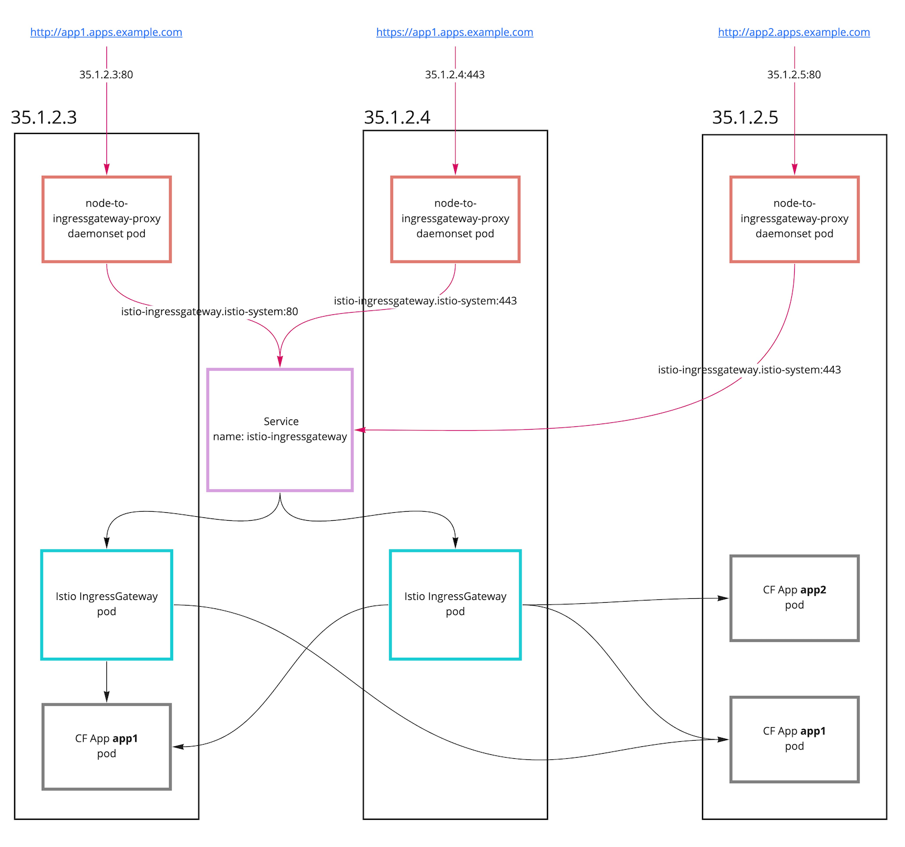

# Ingress Routing Without a LoadBalancer Service

On cloud providers that support external load balancers, a typical production installation will use a [LoadBalancer Service](https://kubernetes.io/docs/concepts/services-networking/service/#loadbalancer) to allow traffic to reach the Istio IngressGateway Envoys.

For non-production use cases (e.g. demos or testing), it can be useful to not require a load balancer and instead have DNS (or client-side /etc/hosts) resolve directly to the IP(s) of Kubernetes workers.

We can support these use cases by deploying a DaemonSet of statically configured Envoy proxies that forward ingress traffic on port 80/443 of the Kubernetes workers to the Istio IngressGateway pods. 

As an example, let's consider a Kubernetes cluster with three worker nodes. These workers are externally reachable at `35.1.2.3`, `35.1.2.4`, and `35.1.2.5`. DNS has been configured to map `*.apps.example.com` to these three IP addresses.

The following diagram shows what this might look like:

## Installation

The DaemonSet is now deployed by default with cf-k8s-networking.
