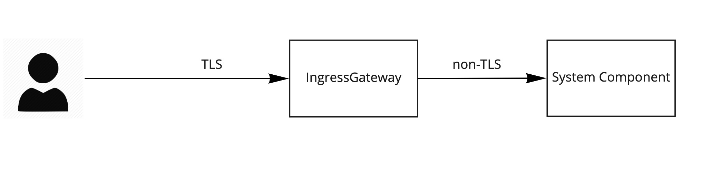
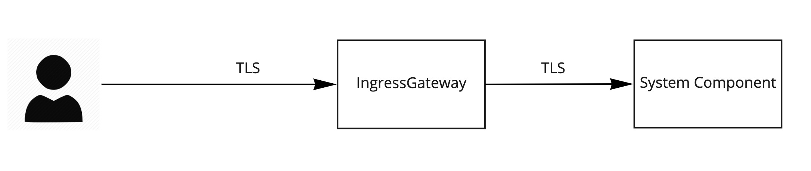

# Ingress Routing to System Components

⚠ **EXPERIMENTAL** ⚠ 👷🏽‍♀️🚧

This documents current workflows for **experimenting** using cf-k8s-networking to route to system components. System component authors can follow the appropriate example to have plaintext or TLS connections from the gateway to their system component. These example workflows currently require generating and managing the certificates for the ingress gateway.

## Example: TLS Termination at the Ingress Gateway, Plaintext to System Component


1. Make CA and wildcard cert
    (customize the script with the system domain for your environment)
    ```
    ./generate-tls-certs.sh sys-wildcard *.sys.domain.of.system
    ```

2. Store the wildcard cert in kubernetes so it can be served by the Istio ingress gateway

    This command isn't idempotent, and new secrets may not get picked up by running ingress pods.
    So, to *change* the secret, the process is 3 steps:

    ```
    kubectl -n istio-system delete secret istio-ingressgateway-certs
    kubectl -n istio-system create secret tls istio-ingressgateway-certs --cert sys-wildcard.crt --key sys-wildcard.key
    kubectl -n istio-system delete pod -n istio-system -l istio=ingressgateway
    ```


3. Install an istio gateway for your system domain
   Customize the yaml with the system domain for your environment

    ```
    kubectl apply -f examples/system-component-non-tls/example-sys-gateway.yaml
    ```

4. Install your system component
   Update the templates with your own component name and routes.

    ```
    kubectl apply -f examples/system-component-non-tls/example-sys-component.yaml
    ```

5. Test it out
    ```
    curl -v --cacert sys-wildcard-ca.crt https://some-cf-component.sys.eirini-dev-1.routing.lol
    ```

## Example: TLS Termination at the Ingress Gateway, TLS Reestablished to System Component


The following steps configure the Istio IngressGateway routers to terminate TLS and then reestablish TLS with a TLS-supporting backend.

Reference the `istio-conf.yaml` and `nginx.yaml` templates in `examples/nginx-tls` to see what these resources look like. We will be creating the following:

1. A new Istio `Gateway` in the `cf-system` namespace for handling the `*.<system-domain` wildcard route that will direct traffic to all system components.
1. Two specially named `Secret`s: `istio-ingressgateway-ca-certs` and `istio-ingressgateway-certs` that will contain our wildcard system domain certs and the trusted CAs for backend services. Istio mounts these secrets onto the `istio-ingressgateway` pods by default.
1. A `Deployment` that deploys a simple nginx proxy to represent our system component.
1. A `Secret` named `nginx-certs` that contains the TLS certs for our system component (e.g. certs for `nginx.<system-domain>`)
1. A `ConfigMap` that contains the `nginx.conf` configuration for our system component. This configuration includes references to the certs in the `nginx-certs` secret.
1. A `Service` named `nginx` that provides basic Kubernetes internal networking to our system component pods
1. A `VirtualService` named `external-route-for-nginx` that instructs Istio to configure the ingress router to allow external routing to our system component pods
1. A `DestinationRule` named `nginx-destination` that instructs Istio to configure the ingress router to use TLS when routing to our system component

If you already have your own certificates that you'd like to use, feel free to skip the cert generation steps.
These steps are subject to change as the cert-management story for CF on Kubernetes evolves.

## Cert Generation

1. Make CA and wildcard certs for your system domain

    Replace `<system-domain>` with the system domain for your environment.
    
    ```
    ./generate-tls-certs.sh sys-wildcard *.<system-domain>
    ```

 1. Make external CA and certs for your system component
 
     In this example we will be deploying an nginx proxy to stand in as our system component.
     
     ```
     ./generate-tls-certs.sh nginx nginx.<system-domain>
     ```
    
  1. Make internal CA and certs for your system component
   
       This can be used by clients communicating on the Kubernetes DNS address. e.g. `nginx.cf-system.svc.cluster.local`
       
       ```
       ./generate-tls-certs.sh nginx-internal nginx.cf-system.svc.cluster.local
       ```
    
  1. Make CA and certs for your mTLS client
   
       In this example we will be using `curl` as an mTLS client of the system component.
       
       ```
       ./generate-tls-certs.sh client client-cert
       ```

## Deploy the Components

We'll be deploying a "system component" `Deployment` that creates pods comprised of two containers.
An `nginx` proxy container accepts connections on ports `80` (HTTP), `443` (TLS), and `9443` (mTLS) and forwards them over plaintext to an `httpbin` container.

The `mTLS` port is only reachable internally via the service url (e.g. `nginx.cf-system.svc.cluster.local`) and not via the ingress gateway.

### Prerequisites
- A Kubernetes cluster with [Istio installed using the default configuration](https://istio.io/docs/setup/install/helm/)
- `kubectl` installed and access to the Kubernetes cluster
- [`kapp`](https://get-kapp.io/) installed
- [`ytt`](https://get-ytt.io/) installed

1. Use `ytt` to template the config files and `kapp` to deploy the system component and debug pod to support Ingress TLS and internal mTLS between components for the "Component Owned Cert without Sidecar" scenario.

    Replace `$system_domain` with the system domain for your environment and reference the cert prefixes you used earlier.
    Below is an example for our `eirini-dev-2` environment.

    ```bash
    system_domain="sys.eirini-dev-2.routing.lol"
    wildcard_system_domain="*.${system_domain}"
    ingress_router_cert_prefix="sys-wildcard"
   
    system_component_external_address="nginx.${system_domain}"
    system_component_cert_prefix="nginx"
    
    system_component_internal_cert_prefix="nginx-internal"

    ytt -f examples/nginx-tls/nginx.yaml \
        -f examples/nginx-tls/istio-conf.yaml \
        -f examples/nginx-tls/values.yaml \
        --data-value nginxConfig="$(cat examples/nginx-tls/nginx.conf)" \
        --data-value backendTlsKey="$(cat $system_component_cert_prefix.key)" \
        --data-value backendTlsCert="$(cat $system_component_cert_prefix.crt)" \
        --data-value backendCaCert="$(cat ${system_component_cert_prefix}-ca.crt)" \
        --data-value internalBackendTlsKey="$(cat $system_component_internal_cert_prefix.key)" \
        --data-value internalBackendTlsCert="$(cat $system_component_internal_cert_prefix.crt)" \
        --data-value internalBackendCaCert="$(cat ${system_component_internal_cert_prefix}-ca.crt)" \
        --data-value clientTlsKey="$(cat client.key)" \
        --data-value clientTlsCert="$(cat client.crt)" \
        --data-value clientCaCert="$(cat client-ca.crt)" \
        --data-value ingressTlsKey="$(cat $ingress_router_cert_prefix.key)" \
        --data-value ingressTlsCert="$(cat $ingress_router_cert_prefix.crt)" \
        --data-value systemWildcardDomain="${wildcard_system_domain}" \
        --data-value systemComponentExternalAddress="${system_component_external_address}" \
        | kapp deploy -a sys-component -f - -y
    ```

1. Delete the `istio-ingressgateway` pods so that they can be recreated with the updated secrets

    ```bash
        kubectl -n istio-system delete pods -l app=istio-ingressgateway
    ```

1. Validate that you can reach the component

    ```bash
        curl --cacert "${ingress_router_cert_prefix}-ca.crt" "https://${system_component_external_address}"
    ```

1. Validate that you can connect to the component using mTLS from the debug-pod

    ```bash
        kubectl -n cf-system exec -it <debug-pod-name> /bin/bash

        curl --cacert /etc/mtls-client-certs/backend_ca.crt \
             --key /etc/mtls-client-certs/tls.key \
             --cert /etc/mtls-client-certs/tls.crt \
             https://nginx.cf-system.svc.cluster.local:9443
    ```
